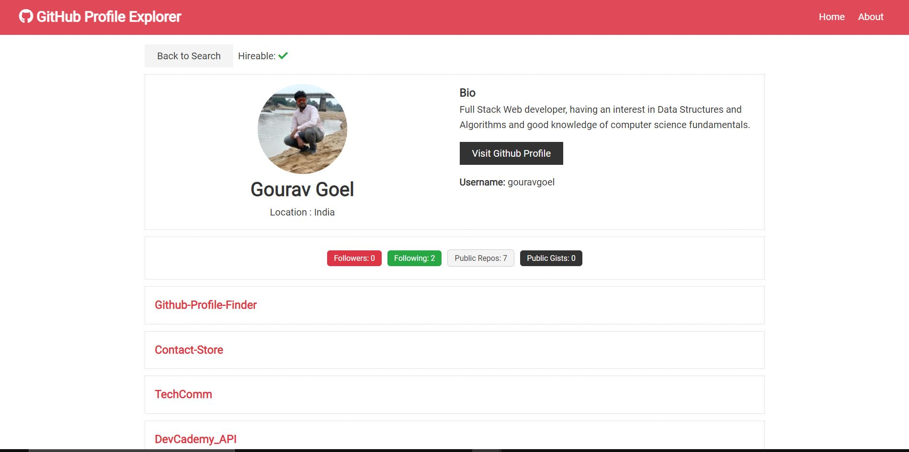

> A Simple React Application that fetches github profile data from github api

## Deployed Application
[Click Here](https://github-profile-explorer.netlify.app/)



## Tech Stack

ReactJS, context-api, axios, react-dom, github-api

## Install Dependencies

```
npm install
```

## Run App

```
npm start
```
